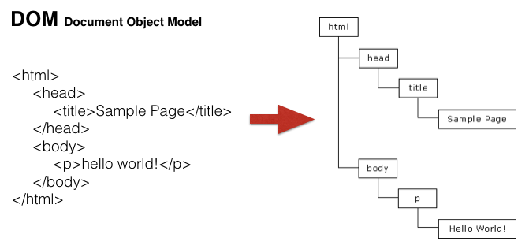
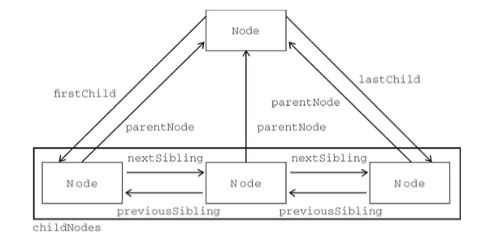

##  DOM  
######DOM(Document Object Model)是指文档对象模型;  
    
`如图所示,DOM树从根节点<html>往下分为<head>标签和<body>标签,再从<head>标签往外分成<tatle>,<meta>等等,<body>分成了内容标签或者内容等;`
###  DOM分类:  
######  按照节点类型分类:  
* 1.元素节点;
* 2.属性节点;
* 3.文本节点;
* 8.注释节点;
* 9.document节点;  

######  按照层级的形式分类:  
1. 父节点;
2. 子节点;
3. 兄弟节点;  

######  注意:  
1. nodeType;  返回节点的类型;
2. nodeName;  返回节点的名称;
3. nodeValue;  返回节点的值;    
######  例: 
 		
123
  
 		    
`nodeType返回的是节点的序号,div是一个元素,所以返回的是1;表示元素节点;"nodeName"返回的是节点的名称;"nodeValue"是获取节点的值;`
 		

###  我们可以通过JS来修改和控制DOM元素:  
######  获取元素的第一层子节点:  
* children和childNodes;

		例:
			

				1
				
2

				<a>3</a>
			

			  
`这个例子中,span.p.a标签都是box的子节点,而且都在第一层,所以,通过"box.children"打印出来的结果是肯定会把这三个标签获取到,但是你会发现"box.childNodes"打印出来的结果长度是7.因为"box.childNodes"会把代码换行当做空白文本也解析出来,而children不会;`  
######  区别:  
	1. children在标准浏览器和IE9下不会造成空白文本解析,获取到的是真实的子节点,不支持IE6,7,8;
	2. childNodes会解析空白的文本节点;  
  
######  获取元素的第一个子节点:   
* firstChild和firstElementChild;  
  
		例:
			

				1
				
2

				<a>3</a>
			

			  
`这个实例中,"box.firstChild"打印出来的结果是空白文本节点,"box.firstElementChild"打印的结果是"1",两个都是获取第一个子节点,但是"box.firstChild"会检测到空白文本节点;`  
######  区别:  
	1. firstChild在标准和IE9以下浏览器会获取到空白文本节点;
	2. firstElementChild在标准浏览器下可以获第一个子节点元素,IE6,7,8不支持;  
	  
######  获取指定元素的最后一个子节点:   
* lastChild和lastElementChild;  
  
		例:
			

				1
				
2

				<a>3</a>
			

			  
`在例子中,使用"box.lastChild"和"box.lastElementChild"来分别打印出box的最后一个子节点,"box.lastElementChild"可以正常的获取到"<a>3</a>","box.lastChild获取到的是空白文本节点;`  
######  区别:  
	1. lastChild在标准和IE9以下浏览器会获取到空白文本节点;
	2. lastElementChild在标准浏览器下可以获第一个子节点元素,IE6,7,8不支持;  
	  
######  获取指定元素的上一个兄弟节点:   
* previousSibling和previousElementSibling;  

######  获取指定元素的下一个兄弟节点:    
* nextSibling和nextElementSibling;  

######  例:  
	<ul>
		<li>1</li>
		<li>2</li>
		<li>3</li>
		<li>4</li>
	</ul>
	
`在本例中"ul.lastElementChild.previousSibling",指的是ul标签下的最后一个子节点的上一个子节点,但是"previousSibling"会获取空白文本节点,所以注释为"1"的打印结果是空白文本节点,注释为"2"的"previousElementSibling"不会获取空白文本节点,是真实的元素,所以,注释"2"的打印结果是"<li>3</li>";下面注释为"3"和"4",表示的是获取ul的第一个子节点的下一个子节点,"nextSibling"打印的是空白文本节点,"nextElementSibling"打印的是"<li>2</li>";`  
######  区别:
	综上所述,在获取节点的方法中,带Element的都不会获取到空白文本节点,获取到的都是真实的子节点;   
######  获取指定元素的父节点:  
* parentNode和offsetParent;
  
		例:
			

				1
				
2

				<a>3</a>
			

			    
`"parentNode"表示获取指定元素的父节点,所以"console.log(p.parentNode);"获取到的是p标签的父级"box";而"offsetParent"表示获取离置顶元素最近的,并且具有定位属性的节点;但是所有的标签都没有给过定位,所以会直接找到<body>;`  

  
    
###  DOM的增删改查    
######  创建节点:  document.createElement("标签名");
	例:
			
`在结构中创建一个标签,在括号中的引号中写标签名,但是只是创建出来,不会再页面显示出来;`  
######  给指定元素追加子节点:  oppendChild("标签名");  
	例:
			
`先用"document.createElement"方法创建一个div标签,在使用"appendChild"方法把这个div追加到<body>标签中,所以在页面就就可以看到这个使用"document.createElement"方法创建的标签了;`  
######  插入元素:  insertBefore(插入的元素,参照元素);  
	例:
		var body = document.getElementsByTagName("body")[0];
		var box = document.getElementById('box');
		var div = document.createElement("div");
		body.insertBefore(div,box);  
`"insertBefore"有两个参数,第一个表示插入的元素,第二个表示插入时参照的元素;和".appendChild"作用类似,不同的是"appendChild"是给摸个元素之后追加子节点,而"insertBefore"是在指定参照元素之前插入节点;`  
######  移除子节点:  removeChild( );  
	例:  
		

	 		
1

	 		<a href="">2</a>
	 		3
		

		
		
`例子中"box"有三个子节点,分别是"p"标签,"a"标签,"span"标签;在JS中使用"removeChild"方法,移除"box"的"a"标签;`  
######  替换子节点:  replaceChild(替换元素,被替换元素);  
	例:
		

	 		<a href="">2</a>
		
 
		
		 
`原本在"box"中只有一个"a"标签,在JS中用"document.createElement"方法创建一个div,使用"replaceChild"用"div"来替换"a"标签,两个参数第一个代表要替换上去的元素,第一个代表被替换的元素;在"box"中你会发现"a"标签不见了,取而代之的是"div";如果替换元素使结构中已有的元素,相当于是删除被替换的元素;`   
######  克隆节点:  cloneNode( );  
	例:
		

	 		<a href="">2</a>
		
 
		
		  
`"cloneNode"克隆节点,可以把指定元素赋值出来,如例子中所示,把"box"克隆下来,添加到"body"中,在结构中就会有两个ID名为"box"的div;"cloneNode"还接受两个参数,true和false,当参数时true的时候表示会克隆元素的innerHTML,false也不会;默认也是false;所以当我们不传参数的时候,"cloneNode"克隆的只是指定的这一个元素节点,当我们传递参数true时,"cloneNode"会把指定元素所有的子节点也克隆下来;`  
######  判断指定元素是否拥有子节点:  hasChildNode( );  
	例:
		

 
		
		
`hasChildNode( )方法用来检测指定的元素是否有子节点,返回的是布尔值,如果有子节点返回true,没有则返回false;在本例中"box"元素没有任何子节点,所以返回的是false;`  
######  获取元素所有的子节点:   childNodes;  
	例: 
		

	 		
1

	 		<a href="">2</a>
	 		3
		

		
		
`childNodes是一个属性,不是方法,所以不能加括号;例子中获取box的所有的子节点,结果长度是7,因为"childNodes"会把空白文本也获取到`