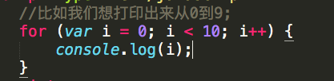

# JS基础
***
### 数据类型  

 | number | string | object | undefined | null | boolean|  
 | ------ | ------ | ------ | --------- | ---- | ------- | 
 | 数字类型 | 字符串类型| 对象类型 | 未定义类型 | 空类型 | 布尔类型 |  
 
##### 1.number(数字)类型:  
`包括整数和小数和NAN,除了我们通常使用的十进制,还可以用八进制和十六进制表示;还有一个特殊数字NAN,NAN与任何数字都不相等,包括他自己.任何涉及到NAN的操作也会返回NAN`   

###### 比如:
1. `var num1=34;` 整数  
2. `var num2=34.00`  小数

###### 可以把其他数据类型转换为数字类型:

1. **Number( )**  方法强制转换为数字类型;
2. **parseInt( )** 方法取整;
3. **parseFloat( )** 方法取小数;
4. **isNAN( )** 方法来判断这个数字是不是NAN;  

###### 还有一种隐式数据类型转换:  
1. `字符串`+`数字`结果是`字符串`;
2. +`字符串`会得到`数字`类型,加号相当于取整数;

###### 另外undefined = NAN ; null = 0;  

##### 2.string(字符串)类型:  
`字符串String是由双引号或者单引号包裹起来的数字字母或者符号,需要注意一点,只要用引号包裹起来的都是字符串类型,包括引号包裹起来的数字.`  
###### 比如:
* `var str = "Bill"; `  字符串

###### 可以把其他数据类型转换为数字类型:  
* **String( )** 方法可以把其他类型转换为字符串类型;

##### 3.Object(对象)类型:  
`对象由花括号分隔。在括号内部，对象的属性以名称和值对的形式 (name : value) 来定义。花括号内每个属性用逗号隔开.`
###### 比如:
* `var person={name:"张三", age:"22"};` 对象类型;  

##### 4.Undefined(未定义)类型: 
`Undefined 这个值表示变量不含有值。或者说没有定义的,定义了没有赋值的`
###### 比如:
* `var n;` undefined类型;  

##### 5.Null(空)类型:
`没有定义过的,也可以用他来吧其他变量设为空类型`;
###### 比如:
* `var n = null;` null类型;  

##### 6.Boolean(布尔)类型:
`布尔类型一般用作判断,有两个值true(真的)和false(假的);一般我们认为非0即为真;`
###### 比如:
1. `var n = true;` 表示这个变量布尔类型为真;  
2. `var n = false` 表示这个变量布尔类型为假;

### typeOf关键字:
###### typeof 可以用来检测给定变量的数据类型，可能的返回值：
1. `undefined`  表示这个值未定义;
2. `boolean`  表示这个值是布尔值;
3. `string`  表示这个值是字符串;
4. `number`  表示这个值是数字类型;
5. `object`  表示这个值是对象类型;
6. `null`  表示这个值是空类型;  

***
### 变量
>变量是用来存储内容的空间,JS变量通常var关键字来定义,未经初始化时，保存的是一个特殊的值-undefined。

  
##### 全局变量和局部变量  
全局变量是整个代码中都可以调用的变量,而局部变量是指只能在本变量声明的函数内部调用,在函数内部没有用var关键字定义的变量JS也会当做全局变量来处理; 在函数内部可以访问到全局变量,但是在函数外面访问不到局部变量; 
###### 例如:  
      var num = 0;                       //全局变量
      function fn1(){
      		var num = 1;                 //局部变量
      		alert(num);
      }
	  alert(num);                        //结果是0;
	  fn1();                             //结果为1;
	     
`以上的例子在fn1函数外面定义了一个变量num = 0,fn1函数内部定义了一个变量num = 1,函数外面的num = 0 为全局变量,函数里面的num = 1 是局部变量,在函数中可以访问到外面的全局变量,但是在函数外面访问不当函数里面的局部变量;但是函数内部的局部变量的优先级会高于全局变量,所以,fn1执行的alert(num)的结果为1,而函数外面执行的alert(num)结果是0;` 
##### 变量声明提升:  

     num = 0;
     var num;
     console.log(num);

`一个最简单的例子,在代码中写入一个没有定义的变量,在他下面在用var关键字定义,最后打印出来的也会是写在前面的值;因为浏览器在读取代码时,会把带var关键字定义的首先处理,会把上面例子的代码这样处理:`  

         var num;
         num = 0;

`会先进行变量声明,然后在进行赋值;`  
###### 例子:
        function fn1(){
        		console.log(a);
        		var a = 1;
        }

`他的处理过程是:`   
 
        function fn1(){
        		var a;
        		a = 1;
        		console.log(a);
        }           

`所以结果是1;`   
###### 浏览器在读取我们代码时,会先把变量名和函数名抓取到,然后在当前作用域的最顶层进行声明;
##### 函数声明提升:   
          a();    
		  var a;
          function a(){
               console.log(1);
          }
          a=function(){
               console.log(2);
         };
           
`这个例子会先进行函数声明提升,会把函数先处理,然后在进行变量声明提升,处理过程:`  

          function a(){
    			console.log(1);
		  }
          var a;                           //并不执行，重复的声明
		  a();    
		  a=function(){
     			console.log(2);
		  }
`在刚开始会先声明函数名a,浏览器不会执行重复的声明,所以变量a不会执行,代码执行的结果是1;`
###### JS命名规范:
1. 由数字字母下划线和美元符组成,第一位不能是数字;
2. 驼峰命名法(不用连字符,改为首字母大写);
3. 避免和系统关键字重复;
4. 要区分大小写;

***
### 函数  
>函数是具有特定功能的代码片段,分为命名函数和匿名函数 

###### 函数的基本要素:
1. 要用function关键字定义;
2. 函数要有对应的函数名,匿名函数除外;
3. 函数的调用方式: 函数名( );
4. 函数默认返回undefined,可以用return关键字来修改,返回的内容放到return之后;

`注意:函数不调用不会执行;return之后的任何代码都将不会执行;`

###### 命名函数书写形式:

      function 函数名(){
      		函数执行的代码
	  }
	  函数名( )               //会使函数立即执行;
	  
`函数名( ) 会使函数立即执行,当我们希望在某个事件触发之后执行这个函数,只需要在给那个事件赋值函数的时候把函数名自额上就可以了,一定不要加括号;`

###### 例子:
           function fn1(){
           		console.log(this)             
           }
           fn1();                      //结果是window
           box.onclick = fn1();        //结果是box;

`函数里面的this默认指向window,但是当函数有所属关系的时候,函数内的this指向函数的所有者;`
###### 匿名函数书写形式:

		function(){
			.....
		}
`匿名函数不需要加函数名,调用的方式:`  

* 把匿名函数赋值给元素的某个事件,事件触发,执行函数;  

		box.onclick = function(){
			....
		}
* 把函数赋值给元素的某个变量,变量名加小括号执行  
  
  		var fn1 = function(){
  			...
  		}
  		fn1( );
* 匿名函数自执行,把函数整体放倒一个小括号内,后面加小括号执行

		(function(){
			...
		})( );
		
###### 函数还可以返回值和参数来分类:
1. 无参数无返回值;
2. 无参数有返回值;
3. 有参数无返回值;
4. 有参数有返回值;  

***

### 分支
######  分支有两种情况:  
1.  if..else分支  
  
`if后面括号中写判断条件,如果条件成立执行花括号中的代码,如果不成立,执行else后面的代码;`  
2.  switch case 多分支  
  
`seitch后面括号中写判断条件,case后面写各种情况,代码会从上到下执行,如果满足其中一个case的情况,就执行这个情况后面的执行语句,如果所有的情况都不满足,则执行define的代码;`

######  例子1:
	var num = 5;
	if(num > 5){
		console.log("这是比5大的数,不包括5");
	}else if(num == 5){
		console.log("这个数字是5");
	}else{
		console.log("这是比5小的数,不包括5");
	}
`先定义一个num = 5;在if判断条件中写num > 5,因为num等于五,所以不会执行第一个if后面的代码,继续往下走num == 5,条件成立,所以会执行console.log("这个数字是5");找到了满足条件的判断,就不会继续往下走,所以最后的else也不会执行;`  
  
######  例子2:  
	var today = "星期天";
	switch(today){
		case "星期一":
			console.log("周一");
		break;
		case "星期二":
			console.log("周二");
		break;
		case "星期三":
			console.log("周三");
		break;
		case "星期四":
			console.log("周四");
		break;
		case "星期五":
			console.log("周五");
		break;
		case "星期六":
			console.log("周六");
		break;
		default:
			console.log("放假");
		break;
	}
`定义一个变量today = "星期天";在分支语句中进行判断,满足case的情况才会执行后面的代码,所有的case都不满足才会执行define;本例子中前面的case情况都不满足,所以不会执行case后面的代码,执行define后面的代码;`  
######注意:
1. 每一种情况写完都要写break,如果不写,会从符合条件的case开始一直执行到最后.
2. 根据对应条件可以执行case,条件以外的判断会进入define;
3. 在JS中,switch和case的值可以使常量,变量,表达式;  
***  
### 循环  
* for循环    
  
`for循环可以帮我们完成重复的事件;在括号中写循环条件,var i = 0 表示循环变量初始化,i < 10 表示循环条件; i++ 是循环变量变化;后面的花括号中是循环的语句;适合已知次数的循环`  
* while循环  
  
`在while后面的括号里面写循环条件,适合未知次数的循环;`  
* do..while循环  
  
`do..while循环会先执行一次do里面的代码,然后在进行循环,循环条件下载while里`   
 
###### while循环和do..while循环的区别:  	
1. while循环是只有满足循环条件的前提下,才会执行循环语句.不满足不执行.
2. do...while循环会先执行一遍do里面的内容,然后再判断循环条件是否满足,如果满足继续执行,如果不满足则终止.  
  
######  例子1:  
	for(var i = 0; i < 10; i++){
		document.write("

");
	}  
`本例子表示循环十次document.write("

");也就是在document文档中添加是个Div标签`;  
######  例子2:
	ar i = 0;
	do{
		console.log(i);
		i++;
	}while(i<10);  
`这段代码的意思是打印i值，i一直在加，直到i不小于10为止`  
  
######循环控制:  
1. break语句会立即退出本层循环,循环终止;
2. continue语句会立即跳过本层循环,循环继续;    

  

***
